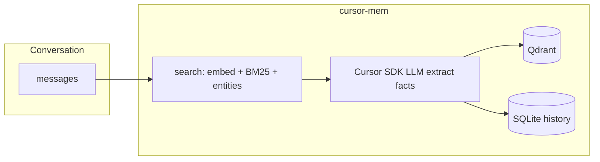

# cursor-mem

[](https://pypi.org/project/cursor-mem0/)
[](https://github.com/xwqiang/cursor-mem0)
[](https://github.com/xwqiang/cursor-mem0/blob/main/LICENSE)

**mem0-compatible AI agent memory for Cursor** — extraction and reasoning via [Cursor SDK](https://cursor.com/docs/sdk/python) (`CURSOR_API_KEY`), local [fastembed](https://github.com/qdrant/fastembed) vectors, [Qdrant](https://qdrant.tech/) store, optional **MCP** tools for Cursor IDE.

> **Search:** `cursor mem0`, `cursor agent memory`, `cursor mcp memory`, `CURSOR_API_KEY memory`, `mem0 cursor sdk`  
> **GitHub topics:** see [`.github/topics.txt`](.github/topics.txt) — apply with `./scripts/github-repo-setup.sh` after `gh auth login`.

AI agent **memory layer** modeled on [mem0](https://github.com/mem0ai/mem0), with one key change: **LLM inference uses [Cursor SDK](https://cursor.com/docs/sdk/python) and `CURSOR_API_KEY`** instead of OpenAI / Anthropic / other third-party LLM API keys.

Everything else follows mem0’s pipeline (v3 additive extraction, hybrid retrieval, entity linking, SQLite history, Qdrant vector store).

## Architecture

| Component | Provider | API key |
|-----------|----------|---------|
| Memory extraction & reasoning | **cursor-sdk** `Agent.prompt` | `CURSOR_API_KEY` |
| Embeddings | **fastembed** (local ONNX) | None |
| Vector store | **Qdrant** (embedded, on disk) | None |
| History | **SQLite** | None |



## Install

From PyPI (recommended):

```bash
pip install cursor-mem0

# MCP server for Cursor agents
pip install "cursor-mem0[mcp]"

# Optional: BM25 + entity extraction (same as mem0[nlp])
pip install "cursor-mem0[nlp]"
python -m spacy download en_core_web_sm
```

> **Note:** PyPI package name is **`cursor-mem0`** (import: `from cursor_mem import Memory`). The name `cursor-mem` on PyPI is a different project (IDE session hooks).

From source:

```bash
pip install -e .

# Optional extras
pip install -e ".[mcp]"
pip install -e ".[nlp]"
python -m spacy download en_core_web_sm
```

## Setup

1. Create an API key: [Cursor Dashboard → Integrations](https://cursor.com/dashboard/integrations)
2. Configure locally (recommended):

```bash
cp .env.example .env
# Edit .env and set CURSOR_API_KEY=...
```

Or export in the shell:

```bash
export CURSOR_API_KEY="cursor_..."
```

Data is stored under `~/.cursor-mem/` (override with `CURSOR_MEM_DIR`).

## MCP in Cursor (project)

This repo includes a **stdio MCP server** so Cursor agents can call `add_memory`, `search_memories`, and `list_memories`.

### 1. Install with MCP extras

```bash
pip install "cursor-mem0[mcp]"
# or from source: pip install -e ".[mcp]"
```

### 2. Project config (already in repo)

File: [`.cursor/mcp.json`](.cursor/mcp.json)

```json
{
  "mcpServers": {
    "cursor-mem": {
      "command": "python3",
      "args": ["-m", "cursor_mem.mcp_server"],
      "cwd": "${workspaceFolder}",
      "env": {
        "CURSOR_API_KEY": "${env:CURSOR_API_KEY}",
        "CURSOR_MEM_USER_ID": "${env:CURSOR_MEM_USER_ID}"
      }
    }
  }
}
```

The server loads `CURSOR_API_KEY` from **`.env`** in the project root when Cursor starts it (`cwd` = workspace).

### 3. Enable in Cursor

1. Open this folder as the workspace (`cursor-mem`).
2. **Cursor Settings → MCP** (or run `/mcp` in chat) and confirm **`cursor-mem`** appears and is enabled.
3. If tools do not show up, reload the window and check MCP logs for `python3` / missing `mcp` package.

### 4. Optional: user-global MCP

To use memory in every project, add the same block to `~/.cursor/mcp.json` and set `cwd` to this repo’s absolute path, or export `CURSOR_API_KEY` globally.

### MCP tools

| Tool | Purpose |
|------|---------|
| `add_memory` | Store facts from conversation (`infer=true` uses mem0 extraction via Cursor SDK) |
| `search_memories` | Semantic + hybrid search |
| `list_memories` | List memories for a `user_id` |
| `get_memory` | Fetch one memory by id |

## Quickstart

Same API as mem0’s `Memory` class:

```python
from cursor_mem import Memory

memory = Memory()

# Add memories from a conversation
memory.add(
    "I prefer dark mode and vim keybindings",
    user_id="alice",
)

# Search
results = memory.search(
    "What are Alice's editor preferences?",
    filters={"user_id": "alice"},
    top_k=3,
)
for item in results["results"]:
    print(item["memory"], item.get("score"))
```

### Chat example

```bash
export CURSOR_API_KEY="cursor_..."
python examples/chat_with_memory.py
```

## Configuration

### Defaults (`Memory()`)

- LLM: `provider: cursor`, model `composer-2.5`, `local.cwd` = current directory
- Embedder: `fastembed` + `thenlper/gte-large` (1024 dims)
- Vector store: local Qdrant at `~/.cursor-mem/qdrant`

### Custom config (mem0-style dict)

```python
from cursor_mem import Memory

memory = Memory.from_config({
    "llm": {
        "provider": "cursor",
        "config": {
            "api_key": "cursor_...",
            "model": "composer-2.5",
            "cwd": "/path/to/project",
        },
    },
    "embedder": {
        "provider": "fastembed",
        "config": {"model": "thenlper/gte-large"},
    },
    "vector_store": {
        "provider": "qdrant",
        "config": {
            "path": "/tmp/my-qdrant",
            "collection_name": "my_memories",
            "embedding_model_dims": 1024,
        },
    },
})
```

### Environment variables

| Variable | Purpose |
|----------|---------|
| `CURSOR_API_KEY` | Cursor SDK authentication (required for LLM) |
| `CURSOR_MEM_DIR` | Storage root (default `~/.cursor-mem`) |
| `CURSOR_MEM_USER_ID` | Default user id in the example script |

## How it maps to mem0

- **Unchanged**: `add`, `search`, `get`, `get_all`, `update`, `delete`, prompts, scoring, entity store, history DB.
- **Swapped**: `mem0.llms.openai.OpenAILLM` → `cursor_mem.llms.cursor.CursorLLM` (registered as provider `cursor`).
- **Default embedder**: `openai` → `fastembed` so you do not need `OPENAI_API_KEY` for vectors.

## Why fastembed for embeddings?

Cursor SDK exposes agent/LLM APIs, not a dedicated embeddings endpoint. mem0 still needs dense vectors for semantic search; **fastembed runs locally** with no cloud API key, which matches the goal of avoiding third-party keys while keeping mem0’s retrieval logic intact.

## License

Apache-2.0 (aligned with mem0 OSS).
