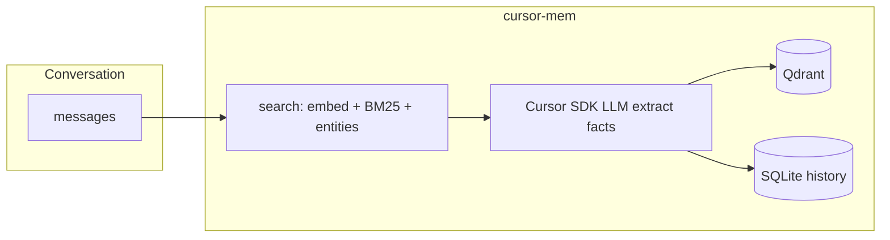

# cursor-mem

**English** · [简体中文](README.zh-CN.md)

[](https://pypi.org/project/cursor-mem0/)
[](https://github.com/xwqiang/cursor-mem0)
[](https://github.com/xwqiang/cursor-mem0/blob/main/LICENSE)

Long-term **memory for Cursor agents**, built on the [mem0](https://github.com/mem0ai/mem0) pipeline. Use your existing **`CURSOR_API_KEY`** for memory extraction (via [Cursor SDK](https://cursor.com/docs/sdk/python)); run **embeddings locally** with [fastembed](https://github.com/qdrant/fastembed); store vectors in on-disk **Qdrant**. Optional **MCP server** exposes memory tools to agents in Cursor IDE.

## Overview

| | |
|---|---|
| **Who it’s for** | Developers using Cursor who want agents to remember preferences and facts across chats |
| **What you need** | Python 3.10+, a [Cursor API key](https://cursor.com/dashboard/integrations), and (for MCP) Cursor with MCP enabled |
| **PyPI package** | `cursor-mem0` — `pip install cursor-mem0` (import: `from cursor_mem import Memory`) |

**Features**

- **One LLM key** — extraction uses `CURSOR_API_KEY`, not a separate OpenAI/Anthropic account for memory
- **Structured memory** — mem0-style fact extraction, hybrid retrieval (vectors + BM25 + entities), SQLite history
- **Efficient context** — `search` returns only top\_k relevant memories instead of reloading a growing markdown file each chat
- **Local embeddings** — fastembed; no embedding API key required
- **MCP tools** — `add_memory`, `search_memories`, `list_memories`, `get_memory` for Cursor agents

**How it compares to common alternatives**

| Approach | Typical trade-off |
|----------|-------------------|
| Default mem0 / multi-key stacks | Extra LLM and often embedding API keys and billing |
| File-based memory (`MEMORY.md`, logs in every prompt) | Token cost grows with file size; weaker retrieval |
| **cursor-mem0** | `CURSOR_API_KEY` + local vectors + retrieval bounded by `top_k` |

Extraction uses Cursor SDK quota when `infer=true`. Embedding runs on your machine.

## Demo

Before/after memory in Cursor, MCP tool calls, and context-size comparison (~49s).


[Full MP4 with controls](https://github.com/xwqiang/cursor-mem0/blob/main/docs/demo.mp4)

## Quick start

### 1. Install

```bash
pip install cursor-mem0

# To use memory tools from Cursor agents:
pip install "cursor-mem0[mcp]"
```

> PyPI name **`cursor-mem0`** is not `cursor-mem` (that package is unrelated IDE session tooling).

### 2. Set your API key

```bash
export CURSOR_API_KEY="cursor_..."
```

Or copy [`.env.example`](.env.example) to `.env` in your project and set `CURSOR_API_KEY` there.

### 3. Use from Python

```python
from cursor_mem import Memory

memory = Memory()

memory.add("I prefer dark mode and vim keybindings", user_id="alice")

results = memory.search(
    "What are Alice's editor preferences?",
    filters={"user_id": "alice"},
    top_k=3,
)
for item in results["results"]:
    print(item["memory"], item.get("score"))
```

Interactive example:

```bash
python examples/chat_with_memory.py
```

Data is stored under `~/.cursor-mem/` unless you set `CURSOR_MEM_DIR`.

## Use with Cursor (MCP)

Add the MCP server to **your** project so agents can store and recall memories during chat.

### 1. Install the MCP extra

```bash
pip install "cursor-mem0[mcp]"
```

### 2. Add MCP config

Copy [docs/mcp.json.example](docs/mcp.json.example) to **your project** as `.cursor/mcp.json` (create the `.cursor` folder if needed), or merge the `cursor-mem` block into your existing MCP config.

Put `CURSOR_API_KEY` in your project `.env` (loaded when the server starts with `cwd` set to the workspace).

### 3. Enable in Cursor

1. Open your project in Cursor.
2. Go to **Settings → MCP** (or type `/mcp` in chat) and enable **`cursor-mem`**.
3. If tools are missing, reload the window and check MCP logs (Python path, `mcp` package installed).

To use memory in **all** projects, add the same server block to `~/.cursor/mcp.json`.

### MCP tools

| Tool | Description |
|------|-------------|
| `add_memory` | Save facts from the conversation (`infer=true` runs mem0 extraction via Cursor SDK) |
| `search_memories` | Semantic and hybrid search |
| `list_memories` | List memories for a `user_id` |
| `get_memory` | Get one memory by id |

## Configuration

**Defaults** (`Memory()`):

| Setting | Value |
|---------|--------|
| LLM | `cursor` provider, model `composer-2.5` |
| Embedder | `fastembed`, `thenlper/gte-large` (1024 dims) |
| Vector store | Local Qdrant at `~/.cursor-mem/qdrant` |

**Environment variables**

| Variable | Description |
|----------|-------------|
| `CURSOR_API_KEY` | Required for LLM / extraction |
| `CURSOR_MEM_DIR` | Storage root (default `~/.cursor-mem`) |
| `CURSOR_MEM_USER_ID` | Default `user_id` in examples |

**Custom config** (mem0-style):

```python
from cursor_mem import Memory

memory = Memory.from_config({
    "llm": {
        "provider": "cursor",
        "config": {
            "api_key": "cursor_...",
            "model": "composer-2.5",
            "cwd": "/path/to/your/project",
        },
    },
    "embedder": {"provider": "fastembed", "config": {"model": "thenlper/gte-large"}},
    "vector_store": {
        "provider": "qdrant",
        "config": {
            "path": "/path/to/qdrant-data",
            "collection_name": "my_memories",
            "embedding_model_dims": 1024,
        },
    },
})
```

**Optional NLP extra** (BM25 + entity boosting, same idea as `mem0[nlp]`):

```bash
pip install "cursor-mem0[nlp]"
python -m spacy download en_core_web_sm
```

**Install from source**

```bash
git clone https://github.com/xwqiang/cursor-mem0.git
cd cursor-mem0
pip install -e ".[mcp]"
```

## Architecture

| Component | Technology | API key |
|-----------|------------|---------|
| Extraction & reasoning | Cursor SDK `Agent.prompt` | `CURSOR_API_KEY` |
| Embeddings | fastembed (local ONNX) | None |
| Vector store | Qdrant (on disk) | None |
| History | SQLite | None |



## Relationship to mem0

cursor-mem0 keeps mem0’s public `Memory` API and retrieval pipeline. Changes:

- LLM provider: `cursor_mem.llms.cursor.CursorLLM` (`provider: "cursor"`) instead of OpenAI by default
- Default embedder: `fastembed` instead of `openai`, so vectors work without `OPENAI_API_KEY`

Cursor SDK does not expose a dedicated embeddings API; local fastembed preserves semantic search without another cloud key.

## License

Apache-2.0
