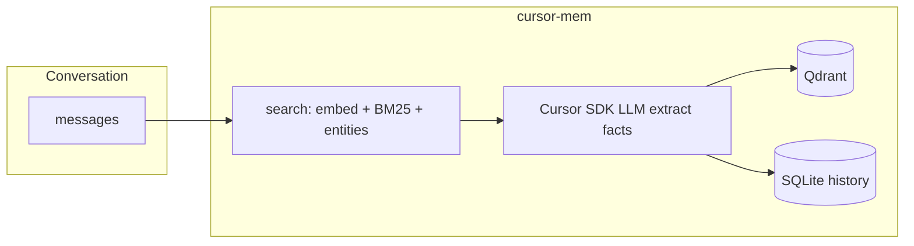

# cursor-mem

[English](README.md) · **简体中文**

[](https://pypi.org/project/cursor-mem0/)
[](https://github.com/xwqiang/cursor-mem0)
[](https://github.com/xwqiang/cursor-mem0/blob/main/LICENSE)

为 **Cursor Agent** 提供跨对话的**长期记忆**，基于 [mem0](https://github.com/mem0ai/mem0) 管线。记忆抽取使用你已有的 **`CURSOR_API_KEY`**（[Cursor SDK](https://cursor.com/docs/sdk/python)）；**向量在本地**由 [fastembed](https://github.com/qdrant/fastembed) 计算；向量数据存入磁盘 **Qdrant**。可选 **MCP 服务** 在 Cursor IDE 中向 Agent 暴露记忆工具。

## 概览

| | |
|---|---|
| **适用对象** | 使用 Cursor、希望 Agent 在多轮对话中记住偏好与事实的开发者 |
| **环境要求** | Python **3.11+**（库）；MCP 的 `mcp.json` 使用 **`uvx --python 3.12`**（`fastembed`/`onnxruntime` 在 3.10 上无可用 wheel）。需 [Cursor API Key](https://cursor.com/dashboard/integrations)、[uv](https://docs.astral.sh/uv/) |
| **PyPI 包名** | `cursor-mem0` — `pip install cursor-mem0`（导入：`from cursor_mem import Memory`） |

**功能要点**

- **单一 LLM Key** — 记忆抽取用 `CURSOR_API_KEY`，无需为记忆单独配置 OpenAI/Anthropic
- **结构化记忆** — mem0 式事实抽取、混合检索（向量 + BM25 + 实体）、SQLite 历史
- **节省 Context** — `search` 只返回 top\_k 相关记忆，避免每轮加载不断变大的 markdown 文件
- **本地向量** — fastembed，无需 embedding 云 API Key
- **MCP 工具** — `add_memory`、`search_memories`、`list_memories`、`get_memory`

**与常见方案对比**

| 方案 | 典型问题 |
|------|----------|
| mem0 默认 / 多 Key 方案 | 需额外 LLM、常需 embedding Key 与计费 |
| 文件型记忆（每轮塞入 `MEMORY.md`、日志） | Token 随文件变大；检索能力弱 |
| **cursor-mem0** | `CURSOR_API_KEY` + 本地向量 + `top_k` 控制注入量 |

`infer=true` 时抽取消耗 Cursor SDK 额度；向量计算在本机完成。

## 演示

使用前后对比、MCP 工具调用与 Context 开销说明（约 49 秒，画面为英文）。


[带控制条的完整 MP4](https://github.com/xwqiang/cursor-mem0/blob/main/docs/demo.mp4)

## 快速开始

### 1. 安装

请使用 **Python 3.11 或 3.12**（推荐 **3.12**）。本地向量依赖 `fastembed` → `onnxruntime`；**Intel Mac（x86_64）没有 Python 3.13 的 `onnxruntime` wheel**，若系统默认 `pip3` 指向 3.13，`pip install` 会报 `ResolutionImpossible`。

```bash
# 推荐：指定 Python 3.12
python3.12 -m pip install cursor-mem0

# 在 Cursor 里给 Agent 用记忆工具：
python3.12 -m pip install "cursor-mem0[mcp]"
```

或用 [uv](https://docs.astral.sh/uv/)（与 MCP / `uvx` 一致，固定 3.12）：

```bash
uv venv --python 3.12
uv pip install "cursor-mem0[mcp]"
```

> PyPI 包名为 **`cursor-mem0`**，不是 `cursor-mem`（后者为无关的 IDE 会话工具）。

**`pip install` 失败，提示 `ResolutionImpossible` / `onnxruntime`？**

| 情况 | 处理 |
| --- | --- |
| Intel Mac，`python3 --version` 为 3.13+ | 改用 **3.12**：`brew install python@3.12`，再 `python3.12 -m pip install cursor-mem0` |
| 默认 `pip3` 为 3.10 | 升级到 3.11+（推荐 3.12） |
| 使用 Cursor MCP | 优先用 [`.mcp.json`](.mcp.json) 里的 **`uvx --python 3.12`**，无需全局 `pip install` |

### 2. 获取 `CURSOR_API_KEY`

cursor-mem0 通过 [Cursor SDK](https://cursor.com/docs/sdk/python) 做记忆抽取，需要的是 **Cursor 账号的用户 API Key**（不是 OpenAI 等第三方 Key）。

1. 登录 [cursor.com](https://cursor.com)。
2. 打开 **[Dashboard → Integrations](https://cursor.com/dashboard/integrations)**（API Keys 页面）。
3. 点击 **Create API key**，起名（如 `cursor-mem`）后复制密钥，一般以 `cursor_` 开头。
4. 勿将密钥提交到 git 或公开仓库。

> Cursor SDK 暂不支持团队 **Admin** API Key，请使用个人用户 Key。

### 3. 在本地配置 Key

**方式 A — 项目 `.env`（配合 MCP 推荐）：**

```bash
cp .env.example .env
# 编辑 .env：
# CURSOR_API_KEY=cursor_...
```

**方式 B — 终端导出：**

```bash
export CURSOR_API_KEY="cursor_..."
```

### 4. Python 调用

```python
from cursor_mem import Memory

memory = Memory()

memory.add("I prefer dark mode and vim keybindings", user_id="alice")

results = memory.search(
    "What are Alice's editor preferences?",
    filters={"user_id": "alice"},
    top_k=3,
)
for item in results["results"]:
    print(item["memory"], item.get("score"))
```

交互示例：

```bash
python examples/chat_with_memory.py
```

默认数据目录：`~/.cursor-mem/`（可用 `CURSOR_MEM_DIR` 修改）。

## 在 Cursor 中发现本插件

用户可通过社区目录或官方市场搜索安装（无需 clone 本仓库）：

| 渠道 | 说明 |
|------|------|
| **[cursor.directory](https://cursor.directory)** | 搜索 memory / mem0；识别仓库根目录 [`.mcp.json`](.mcp.json) / [`mcp.json`](mcp.json)。发布后可在 [此处提交](https://cursor.directory/plugins/new)。 |
| **[Cursor Marketplace](https://cursor.com/marketplace)** | Cursor → Settings → Plugins → Browse Marketplace。需 [`.cursor-plugin/plugin.json`](.cursor-plugin/plugin.json) 并通过 [发布审核](https://cursor.com/marketplace/publish)。 |

仓库已包含 **Cursor 插件清单** 与 **MCP 配置**，目录站可生成 **Add to Cursor**。MCP 通过 `uvx --python 3.12` 从 PyPI 拉取 `cursor-mem0`（需安装 [uv](https://docs.astral.sh/uv/)）。

## 在 Cursor 中使用（MCP）

### 方式 A — 目录一键安装（推荐）

1. 安装 [uv](https://docs.astral.sh/uv/)（若尚未安装）。
2. 配置 `CURSOR_API_KEY`（见上文「获取 Key」）。
3. 将 [mcp.json](mcp.json) 复制到你项目的 `.cursor/mcp.json`，或在 [cursor.directory](https://cursor.directory) 收录后使用 **Add to Cursor**。
4. 可在项目 `.env` 中填写 Key（配置中的 `envFile` 会自动加载）。

无需 `pip install`，首次运行 `uvx` 会从 PyPI 安装 `cursor-mem0[mcp]`。

### 方式 B — pip 安装

```bash
pip install "cursor-mem0[mcp]"
```

将 [docs/mcp.pip.json.example](docs/mcp.pip.json.example) 复制为项目下的 `.cursor/mcp.json`。

### 在 Cursor 中启用

1. 在 Cursor 中打开你的项目。
2. 进入 **Settings → MCP**（或对话中输入 `/mcp`），启用 **`cursor-mem`**。
3. 若看不到工具，重载窗口并查看 MCP 日志（`uvx` / `uv` 是否在 PATH；方式 B 需已 `pip install`）。

若要在**所有项目**使用，将相同配置写入 `~/.cursor/mcp.json`。

### MCP 工具说明

| 工具 | 说明 |
|------|------|
| `add_memory` | 保存对话中的事实（`infer=true` 时经 Cursor SDK 做 mem0 抽取） |
| `search_memories` | 语义与混合检索 |
| `list_memories` | 列出指定 `user_id` 的记忆 |
| `get_memory` | 按 id 获取单条记忆 |

## 配置说明

**默认**（`Memory()`）：

| 项 | 值 |
|----|-----|
| LLM | `cursor`，模型 `composer-2.5` |
| Embedder | `fastembed`，`thenlper/gte-large`（1024 维） |
| 向量库 | 本地 Qdrant，`~/.cursor-mem/qdrant` |

**环境变量**

| 变量 | 说明 |
|------|------|
| `CURSOR_API_KEY` | LLM / 抽取（必需） |
| `CURSOR_MEM_DIR` | 存储根目录（默认 `~/.cursor-mem`） |
| `CURSOR_MEM_USER_ID` | 示例脚本默认 `user_id` |

**自定义配置**（mem0 风格）：

```python
from cursor_mem import Memory

memory = Memory.from_config({
    "llm": {
        "provider": "cursor",
        "config": {
            "api_key": "cursor_...",
            "model": "composer-2.5",
            "cwd": "/path/to/your/project",
        },
    },
    "embedder": {"provider": "fastembed", "config": {"model": "thenlper/gte-large"}},
    "vector_store": {
        "provider": "qdrant",
        "config": {
            "path": "/path/to/qdrant-data",
            "collection_name": "my_memories",
            "embedding_model_dims": 1024,
        },
    },
})
```

**可选 NLP 扩展**（BM25 + 实体增强，同 `mem0[nlp]` 思路）：

```bash
pip install "cursor-mem0[nlp]"
python -m spacy download en_core_web_sm
```

**从源码安装**

```bash
git clone https://github.com/xwqiang/cursor-mem0.git
cd cursor-mem0
pip install -e ".[mcp]"
```

## 架构

| 组件 | 技术 | API Key |
|------|------|---------|
| 抽取与推理 | Cursor SDK `Agent.prompt` | `CURSOR_API_KEY` |
| 向量 | fastembed（本地 ONNX） | 无 |
| 向量库 | Qdrant（磁盘） | 无 |
| 历史 | SQLite | 无 |



## 与 mem0 的关系

对外仍使用 mem0 的 `Memory` API 与检索流程。主要差异：

- LLM：`cursor_mem.llms.cursor.CursorLLM`（`provider: "cursor"`），替代默认 OpenAI
- 默认 embedder：`fastembed`，无需 `OPENAI_API_KEY` 即可做语义检索

Cursor SDK 不提供专用 embedding 接口；本地 fastembed 在不再增加云 Key 的前提下保留语义搜索能力。

## 许可证

Apache-2.0
