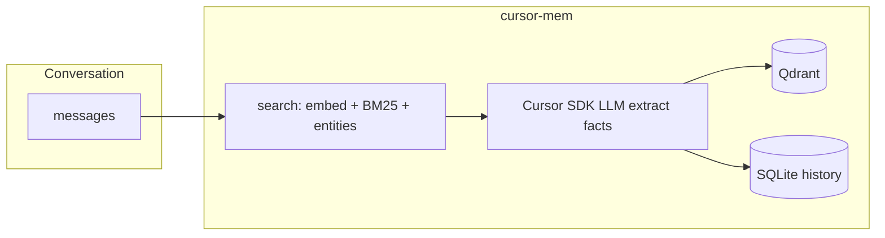

# cursor-mem

[English](README.md) · **简体中文**

[](https://pypi.org/project/cursor-mem0/)
[](https://github.com/xwqiang/cursor-mem0)
[](https://github.com/xwqiang/cursor-mem0/blob/main/LICENSE)

为 **Cursor Agent** 提供跨对话的**长期记忆**，基于 [mem0](https://github.com/mem0ai/mem0) 管线。记忆抽取使用你已有的 **`CURSOR_API_KEY`**（[Cursor SDK](https://cursor.com/docs/sdk/python)）；**向量在本地**由 [fastembed](https://github.com/qdrant/fastembed) 计算；向量数据存入磁盘 **Qdrant**。可选 **MCP 服务** 在 Cursor IDE 中向 Agent 暴露记忆工具。

## 概览

| | |
|---|---|
| **适用对象** | 使用 Cursor、希望 Agent 在多轮对话中记住偏好与事实的开发者 |
| **环境要求** | Python 3.10+、[Cursor API Key](https://cursor.com/dashboard/integrations)；使用 MCP 时需开启 Cursor 的 MCP |
| **PyPI 包名** | `cursor-mem0` — `pip install cursor-mem0`（导入：`from cursor_mem import Memory`） |

**功能要点**

- **单一 LLM Key** — 记忆抽取用 `CURSOR_API_KEY`，无需为记忆单独配置 OpenAI/Anthropic
- **结构化记忆** — mem0 式事实抽取、混合检索（向量 + BM25 + 实体）、SQLite 历史
- **节省 Context** — `search` 只返回 top\_k 相关记忆，避免每轮加载不断变大的 markdown 文件
- **本地向量** — fastembed，无需 embedding 云 API Key
- **MCP 工具** — `add_memory`、`search_memories`、`list_memories`、`get_memory`

**与常见方案对比**

| 方案 | 典型问题 |
|------|----------|
| mem0 默认 / 多 Key 方案 | 需额外 LLM、常需 embedding Key 与计费 |
| 文件型记忆（每轮塞入 `MEMORY.md`、日志） | Token 随文件变大；检索能力弱 |
| **cursor-mem0** | `CURSOR_API_KEY` + 本地向量 + `top_k` 控制注入量 |

`infer=true` 时抽取消耗 Cursor SDK 额度；向量计算在本机完成。

## 演示

使用前后对比、MCP 工具调用与 Context 开销说明（约 49 秒，画面为英文）。


[带控制条的完整 MP4](https://github.com/xwqiang/cursor-mem0/blob/main/docs/demo.mp4)

## 快速开始

### 1. 安装

```bash
pip install cursor-mem0

# 在 Cursor 里给 Agent 用记忆工具：
pip install "cursor-mem0[mcp]"
```

> PyPI 包名为 **`cursor-mem0`**，不是 `cursor-mem`（后者为无关的 IDE 会话工具）。

### 2. 配置 API Key

```bash
export CURSOR_API_KEY="cursor_..."
```

或在项目根目录将 [`.env.example`](.env.example) 复制为 `.env` 并填写 `CURSOR_API_KEY`。

### 3. Python 调用

```python
from cursor_mem import Memory

memory = Memory()

memory.add("I prefer dark mode and vim keybindings", user_id="alice")

results = memory.search(
    "What are Alice's editor preferences?",
    filters={"user_id": "alice"},
    top_k=3,
)
for item in results["results"]:
    print(item["memory"], item.get("score"))
```

交互示例：

```bash
python examples/chat_with_memory.py
```

默认数据目录：`~/.cursor-mem/`（可用 `CURSOR_MEM_DIR` 修改）。

## 在 Cursor 中使用（MCP）

在**你的项目**里接入 MCP，让 Agent 在对话中写入与检索记忆。

### 1. 安装 MCP 依赖

```bash
pip install "cursor-mem0[mcp]"
```

### 2. 添加 MCP 配置

在项目根目录创建或编辑 `.cursor/mcp.json`：

```json
{
  "mcpServers": {
    "cursor-mem": {
      "command": "python3",
      "args": ["-m", "cursor_mem.mcp_server"],
      "cwd": "${workspaceFolder}",
      "env": {
        "CURSOR_API_KEY": "${env:CURSOR_API_KEY}",
        "CURSOR_MEM_USER_ID": "${env:CURSOR_MEM_USER_ID}"
      }
    }
  }
}
```

建议在项目 `.env` 中配置 `CURSOR_API_KEY`（`cwd` 为工作区时由服务加载）。

### 3. 在 Cursor 中启用

1. 在 Cursor 中打开你的项目。
2. 进入 **Settings → MCP**（或对话中输入 `/mcp`），启用 **`cursor-mem`**。
3. 若看不到工具，重载窗口并查看 MCP 日志（Python 路径、是否已安装 `mcp` 包）。

若要在**所有项目**使用，将相同配置写入 `~/.cursor/mcp.json`。

### MCP 工具说明

| 工具 | 说明 |
|------|------|
| `add_memory` | 保存对话中的事实（`infer=true` 时经 Cursor SDK 做 mem0 抽取） |
| `search_memories` | 语义与混合检索 |
| `list_memories` | 列出指定 `user_id` 的记忆 |
| `get_memory` | 按 id 获取单条记忆 |

## 配置说明

**默认**（`Memory()`）：

| 项 | 值 |
|----|-----|
| LLM | `cursor`，模型 `composer-2.5` |
| Embedder | `fastembed`，`thenlper/gte-large`（1024 维） |
| 向量库 | 本地 Qdrant，`~/.cursor-mem/qdrant` |

**环境变量**

| 变量 | 说明 |
|------|------|
| `CURSOR_API_KEY` | LLM / 抽取（必需） |
| `CURSOR_MEM_DIR` | 存储根目录（默认 `~/.cursor-mem`） |
| `CURSOR_MEM_USER_ID` | 示例脚本默认 `user_id` |

**自定义配置**（mem0 风格）：

```python
from cursor_mem import Memory

memory = Memory.from_config({
    "llm": {
        "provider": "cursor",
        "config": {
            "api_key": "cursor_...",
            "model": "composer-2.5",
            "cwd": "/path/to/your/project",
        },
    },
    "embedder": {"provider": "fastembed", "config": {"model": "thenlper/gte-large"}},
    "vector_store": {
        "provider": "qdrant",
        "config": {
            "path": "/path/to/qdrant-data",
            "collection_name": "my_memories",
            "embedding_model_dims": 1024,
        },
    },
})
```

**可选 NLP 扩展**（BM25 + 实体增强，同 `mem0[nlp]` 思路）：

```bash
pip install "cursor-mem0[nlp]"
python -m spacy download en_core_web_sm
```

**从源码安装**

```bash
git clone https://github.com/xwqiang/cursor-mem0.git
cd cursor-mem0
pip install -e ".[mcp]"
```

## 架构

| 组件 | 技术 | API Key |
|------|------|---------|
| 抽取与推理 | Cursor SDK `Agent.prompt` | `CURSOR_API_KEY` |
| 向量 | fastembed（本地 ONNX） | 无 |
| 向量库 | Qdrant（磁盘） | 无 |
| 历史 | SQLite | 无 |



## 与 mem0 的关系

对外仍使用 mem0 的 `Memory` API 与检索流程。主要差异：

- LLM：`cursor_mem.llms.cursor.CursorLLM`（`provider: "cursor"`），替代默认 OpenAI
- 默认 embedder：`fastembed`，无需 `OPENAI_API_KEY` 即可做语义检索

Cursor SDK 不提供专用 embedding 接口；本地 fastembed 在不再增加云 Key 的前提下保留语义搜索能力。

## 许可证

Apache-2.0
